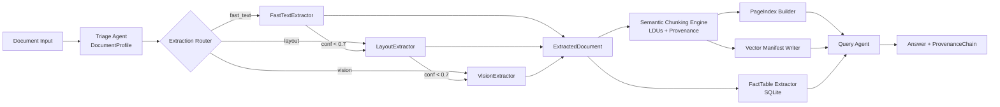

# TRP1 Challenge Week 3 - Final Report

Date: March 7, 2026  
Project: Document Intelligence Refinery  
Repository: `document-intelligence-refinery`

## 0. Executive Summary

This project implements a five-stage, typed document refinery pipeline with adaptive extraction, semantic chunking, PageIndex navigation, query utilities, and provenance-backed auditability.

Current artifact state:

- Profiles: 6 (`.refinery/profiles/*.json`)
- Extraction ledger rows: 14 (`.refinery/extraction_ledger.jsonl`)
- PageIndex artifacts: 1 (`.refinery/pageindex/company_profile.json`)
- Vector manifests: 1 (`.refinery/vectorstore/company_profile.jsonl`)
- SQLite fact rows: 50 (`.refinery/facts.db`, `company_profile`)

## 1. Domain Notes and Strategy Logic

### 1.1 Extraction Decision Tree

1. Triage to `DocumentProfile`
2. Route by estimated extraction cost:
   - `fast_text_sufficient` -> FastTextExtractor
   - `needs_layout_model` -> LayoutExtractor
   - `needs_vision_model` -> VisionExtractor
3. Escalate when confidence is below `escalation.confidence_threshold` (`0.7`)

### 1.2 Thresholds and Rules (Externalized)

From `rubric/extraction_rules.yaml`:

- `fast_text_min_avg_chars_per_page: 150`
- `fast_text_min_char_density: 0.0015`
- `fast_text_max_image_area_ratio: 0.4`
- `escalation.confidence_threshold: 0.7`
- `chunking.max_tokens_per_ldu: 512`
- `chunking.table_preserve_header: true`
- `chunking.keep_numbered_lists_together: true`
- `chunking.attach_captions_to_figures: true`

## 2. Pipeline Architecture

### 2.1 Visual Pipeline Diagram

### 2.2 Implemented Modules by Stage

1. Triage: `src/agents/triage.py`
2. Extraction: `src/agents/extractor.py`, `src/strategies/*`
3. Chunking: `src/agents/chunker.py`
4. Indexing: `src/agents/indexer.py`
5. Query: `src/agents/query_agent.py`, `src/agents/audit_agent.py`
6. Data layer: `src/data/fact_table.py`, `src/data/vector_store.py`

## 3. Failure Modes with Concrete Corpus Examples

| Failure Mode | Concrete Corpus Example | Observed Signal | Mitigation in Pipeline |
|---|---|---|---|
| Scanned text not recoverable by fast extraction | `example_scanned_audit` | `avg_chars_per_page=10.0`, `avg_image_area_ratio=0.85` | Routed to `needs_vision_model`; ledger shows `strategy_used=vision`, `cost_estimate_usd=0.42` |
| Table-heavy documents need structure-aware handling | `example_tax_report` | `layout_complexity=table_heavy`, `table_like_region_ratio=0.8` | Triaged to `needs_layout_model` and normalized into structured tables |
| Mixed image/text docs can be misclassified by single heuristic | `company_profile` | `origin_type=mixed`, `image_area_ratio=0.7933`, yet usable text density | Multi-signal confidence + escalation guard prevents unnecessary vision spend |
| Context fragmentation in retrieval | `company_profile` (pre-fix) | Word-level extraction produced `4989` LDUs and low-quality hits | Upgraded fast extraction to paragraph-level grouping; chunk count reduced to `87` |
| Provenance gaps reduce auditability | Any long report query | Answers require verifiable source location | Every LDU includes `content_hash` + `ProvenanceChain`; query output returns source metadata |

## 4. Side-by-Side Quality Analysis

### 4.1 Strategy-Level Comparison (Ledger-Backed)

| Metric | Fast Text | Vision |
|---|---:|---:|
| Runs | 13 | 1 |
| Avg confidence | 0.802 | 0.900 |
| Avg cost (USD) | 0.000 | 0.420 |
| Avg time (sec) | 5.774 | 4.870 |

Source: `.refinery/extraction_ledger.jsonl` (14 rows).

### 4.2 Chunking Quality Comparison (`company_profile`)

| Dimension | Before Semantic Grouping | After Semantic Grouping |
|---|---:|---:|
| LDU count | 4,989 | 87 |
| Typical retrieval hit | Single token (`"key"`) | Coherent paragraph block |
| Query answer quality | Token fragments | Multi-sentence evidence snippets |

Observation: Paragraph-level block construction significantly improved retrieval coherence and answer usefulness.

### 4.3 Table Extraction Proxy Metrics (`company_profile`)

| Metric | Value |
|---|---:|
| Fact rows extracted | 50 |
| Non-empty value rate | 100% (50/50) |
| Header coverage | 98% (49/50) |

## 5. Provenance Propagation Details

Provenance metadata propagation is implemented explicitly across stages:

1. **Extraction stage**  
   `TextBlock` and other structural units carry page/bbox information.
2. **Chunking stage**  
   Each `LDU` gets:
   - `content_hash`
   - `ProvenanceChain(records=[ProvenanceRecord(...)])`
   - page and bbox (if available)
   - relationship links (`related_ldu_ids`) for cross-references
3. **Query stage**  
   Retrieved LDUs are assembled into answers and their provenance records are returned with the response.

Result: any answer can be traced back to `(document_id, page_number, bbox, content_hash)`.

## 6. Budget Guard Behavior (Vision Path)

Budget guard behavior in `VisionExtractor`:

1. Default budget: `0.50 USD` per document.
2. Per-page processing loop:
   - Estimate cost from model output length:
     - `tokens_estimate = len(text) // 4`
     - `cost_estimate = tokens_estimate / 1000 * 0.15`
   - Accumulate `total_cost_estimate`.
3. Guard condition:
   - If cumulative estimate exceeds budget, log warning and stop processing additional pages.
4. Persisted evidence:
   - Router logs strategy/cost in ledger for audit.

Operational implication: scanned documents are processed with quality priority but bounded cost exposure.

## 7. Tests and Verification

- Test command: `python -m pytest -q`
- Current result: **8 passed** (March 7, 2026)
- Coverage includes:
  - Triage behavior
  - Data-layer ingestion + audit
  - Fast-text grouping
  - Semantic chunking constitution rules

## 8. Deliverables Mapping

### 8.1 Core Models

- `src/models/document_profile.py`
- `src/models/extracted_document.py`
- `src/models/ldu.py`
- `src/models/pageindex.py`
- `src/models/provenance.py`

### 8.2 Agents and Strategies

- `src/agents/triage.py`
- `src/agents/extractor.py`
- `src/strategies/fast_text_extractor.py`
- `src/strategies/layout_extractor.py`
- `src/strategies/vision_extractor.py`
- `src/agents/chunker.py`
- `src/agents/indexer.py`
- `src/agents/query_agent.py`
- `src/agents/audit_agent.py`
- `src/agents/langgraph_query_agent.py`

### 8.3 Data Layer and Artifacts

- `src/data/fact_table.py`
- `src/data/vector_store.py`
- `.refinery/profiles/*.json`
- `.refinery/extraction_ledger.jsonl`
- `.refinery/pageindex/*.json`
- `.refinery/vectorstore/*.jsonl`
- `.refinery/facts.db`

## 9. Remaining Gaps

1. Expand corpus-scale artifacts to >=12 documents across all classes.
2. Add strict table precision/recall using annotated ground truth.
3. Upgrade PageIndex from current shallow structure to full hierarchy extraction.
4. Add 12 cross-class Q/A examples with full provenance citations.

## 10. Conclusion

The refined system now has explicit, test-backed semantic chunking rules, improved chunk quality for retrieval, clearer provenance propagation, and bounded-cost vision processing. With corpus-scale evaluation artifacts and full hierarchical indexing, it is positioned for final rubric-level robustness.
