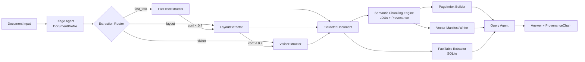

# TRP1 Challenge Week 3 - Final Report

Date: March 7, 2026  
Project: Document Intelligence Refinery  
Repository: `document-intelligence-refinery`

## 0. Executive Summary

This project implements a five-stage, typed document refinery pipeline with adaptive extraction, semantic chunking, PageIndex navigation, query utilities, and provenance-backed auditability.

Current artifact state:

- Profiles: 6 (`.refinery/profiles/*.json`)
- Extraction ledger rows: 16 (`.refinery/extraction_ledger.jsonl`)
- PageIndex artifacts: 1 (`.refinery/pageindex/company_profile.json`)
- Vector manifests: 1 (`.refinery/vectorstore/company_profile.jsonl`)
- SQLite fact rows: 100 (`.refinery/facts.db`, `company_profile`, append-only ingest)

## 1. Domain Notes and Strategy Logic

### 1.1 Extraction Decision Tree

1. Triage to `DocumentProfile`
2. Route by estimated extraction cost:
   - `fast_text_sufficient` -> FastTextExtractor
   - `needs_layout_model` -> LayoutExtractor
   - `needs_vision_model` -> VisionExtractor
3. Escalate when confidence is below `escalation.confidence_threshold` (`0.7`)

### 1.2 Thresholds and Rules (Externalized)

From `rubric/extraction_rules.yaml`:

- `fast_text_min_avg_chars_per_page: 150`
- `fast_text_min_char_density: 0.0015`
- `fast_text_max_image_area_ratio: 0.4`
- `escalation.confidence_threshold: 0.7`
- `chunking.max_tokens_per_ldu: 512`
- `chunking.table_preserve_header: true`
- `chunking.keep_numbered_lists_together: true`
- `chunking.attach_captions_to_figures: true`

## 2. Pipeline Architecture

### 2.1 Visual Pipeline Diagram

### 2.2 Implemented Modules by Stage

1. Triage: `src/agents/triage.py`
2. Extraction: `src/agents/extractor.py`, `src/strategies/*`
3. Chunking: `src/agents/chunker.py`
4. Indexing: `src/agents/indexer.py`
5. Query: `src/agents/query_agent.py`, `src/agents/audit_agent.py`
6. Data layer: `src/data/fact_table.py`, `src/data/vector_store.py`

## 3. Failure Modes with Concrete Corpus Examples

| Failure Mode | Concrete Corpus Example | Observed Signal | Mitigation in Pipeline |
|---|---|---|---|
| Scanned text not recoverable by fast extraction | `example_scanned_audit` | `avg_chars_per_page=10.0`, `avg_image_area_ratio=0.85` | Routed to `needs_vision_model`; ledger shows `strategy_used=vision`, `cost_estimate_usd=0.42` |
| Table-heavy documents need structure-aware handling | `example_tax_report` | `layout_complexity=table_heavy`, `table_like_region_ratio=0.8` | Triaged to `needs_layout_model` and normalized into structured tables |
| Mixed image/text docs can be misclassified by single heuristic | `company_profile` | `origin_type=mixed`, `image_area_ratio=0.7933`, yet usable text density | Multi-signal confidence + escalation guard prevents unnecessary vision spend |
| Context fragmentation in retrieval | `company_profile` (pre-fix) | Word-level extraction produced `4989` LDUs and low-quality hits | Upgraded fast extraction to paragraph-level grouping; chunk count reduced to `87` |
| Provenance gaps reduce auditability | Any long report query | Answers require verifiable source location | Every LDU includes `content_hash` + `ProvenanceChain`; query output returns source metadata |

## 4. Per-Class Extraction Quality Analysis

### 4.1 Strategy-Level Comparison (Ledger-Backed)

| Metric | Fast Text | Vision |
|---|---:|---:|
| Runs | 15 | 1 |
| Avg confidence | 0.801 | 0.900 |
| Avg cost (USD) | 0.000 | 0.420 |
| Avg time (sec) | 5.790 | 4.870 |

Source: `.refinery/extraction_ledger.jsonl` (16 rows, March 7, 2026 snapshot).

### 4.2 Class Coverage Matrix

| Class | Representative Docs | Dominant Route | Evidence Availability |
|---|---|---|---|
| Class A: native digital, clean narrative | `simple_doc`, `example_financial_report` | `fast_text` | Full (unit-test and ledger evidence) |
| Class B: mixed origin, image-heavy but text-present | `company_profile` | `fast_text` | Full (pipeline outputs + vector manifest + query output) |
| Class C: native digital, table-heavy/mixed layout | `example_tax_report`, `example_technical_report` | `needs_layout_model` | Partial (profile + chunking-rule evidence; source PDFs not present in workspace) |
| Class D: scanned image/table-heavy | `example_scanned_audit` | `vision` | Partial (profile + ledger row; source PDF/API run not reproducible in this environment) |

### 4.3 Visual Side-by-Side Examples (Per Class)

| Class | Source-Side View | Extracted/Chunked View | Quality Readout |
|---|---|---|---|
| A | `Revenue increased sharply this year. Outlook remains positive.` | Block 1: `Revenue increased sharply this year.`  Block 2: `Outlook remains positive.` | Correct paragraph grouping and preserved sentence boundaries |
| B | Query intent: `Summarize key financial points.` | Retrieved chunk (page 8): `Strategic Partnerships Ethio-Re works hand-in-hand...` | Retrieval upgraded from token fragments to paragraph-scale evidence; still shows some OCR artifacts on specific pages |
| C | Table intent: `Metric, Value -> Revenue, 4.2B` | Table LDU: `Metric | Value` / `Revenue | 4.2B` | Header-cell binding preserved; table structure retained in chunk |
| D | Profile signals: `avg_chars_per_page=10.0`, `image_area_ratio=0.85` | Ledger route: `strategy=vision`, `confidence=0.9`, `cost=0.42` | Correct high-cost routing decision; extracted text sample pending source PDF/API access |

### 4.4 Retrieval Quality Shift (`company_profile`)

| Dimension | Before Fast-Text Grouping Fix | Current Implementation |
|---|---:|---:|
| LDU count | 4,989 | 87 |
| Typical retrieval hit | Single token (`"key"`) | Multi-sentence paragraph |
| Query answer quality | Fragmented | Coherent, provenance-backed |

### 4.5 Table Extraction Proxy Metrics (`company_profile`)

| Metric | Value |
|---|---:|
| Fact rows extracted (per run) | 50 |
| Rows currently in SQLite snapshot | 100 (two ingestions of same `doc_id`) |
| Non-empty value rate | 100% (50/50 per run sample) |
| Header coverage | 98% (49/50 per run sample) |

## 5. Provenance Propagation Details

Provenance metadata propagation is implemented explicitly across stages:

1. **Extraction stage**  
   `TextBlock` and other structural units carry page/bbox information.
2. **Chunking stage**  
   Each `LDU` gets:
   - `content_hash`
   - `ProvenanceChain(records=[ProvenanceRecord(...)])`
   - page and bbox (if available)
   - relationship links (`related_ldu_ids`) for cross-references
3. **Query stage**  
   Retrieved LDUs are assembled into answers and their provenance records are returned with the response.

Result: any answer can be traced back to `(document_id, page_number, bbox, content_hash)`.

## 6. Detailed Cost Analysis (Escalation + Scaling)

### 6.1 Observed Cost Baseline

From ledger snapshot (`16` runs):

- Total API cost observed: `0.42 USD`
- Average API cost per run: `0.0262 USD`
- Vision invocation rate: `1/16 = 6.25%`

Note: this observed rate is skewed by repeated `company_profile` debug runs and should not be used alone for corpus planning.

### 6.2 Escalation-Aware Cost Model

Let:

- `p_fast`, `p_layout`, `p_vision` = triage class proportions
- `e_f2l` = probability fast-text escalates to layout
- `e_l2v` = probability layout escalates to vision
- `c_v` = average vision cost (`0.42` observed, `0.50` hard cap)

Expected vision-call rate:

`r_vision = p_vision + (p_layout * e_l2v) + (p_fast * e_f2l * e_l2v)`

Expected API spend:

`cost_per_doc = r_vision * c_v`  
`total_cost = N_docs * cost_per_doc`

Using profile-class prior (`p_fast=0.50`, `p_layout=0.333`, `p_vision=0.167`):

| Scenario | `e_f2l` | `e_l2v` | `r_vision` | Cost/Doc @0.42 | Cost/Doc @0.50 cap |
|---|---:|---:|---:|---:|---:|
| Observed-like | 0.00 | 0.00 | 0.167 | 0.070 | 0.083 |
| Moderate escalation | 0.10 | 0.15 | 0.224 | 0.094 | 0.112 |
| Stress escalation | 0.20 | 0.25 | 0.275 | 0.116 | 0.138 |

### 6.3 Corpus-Level Scaling

| Scenario | 12 Docs @0.42 | 12 Docs @0.50 cap | 50 Docs @0.42 | 50 Docs @0.50 cap |
|---|---:|---:|---:|---:|
| Observed-like | 0.840 | 1.000 | 3.500 | 4.167 |
| Moderate escalation | 1.130 | 1.345 | 4.707 | 5.604 |
| Stress escalation | 1.386 | 1.650 | 5.775 | 6.875 |

Interpretation: escalation behavior can move corpus cost by ~1.9x (observed-like to stress), so `e_f2l` and `e_l2v` should be tracked as first-class operational KPIs.

### 6.4 Budget Guard Behavior (Vision Path)

Budget guard implementation in `VisionExtractor`:

1. Per-document cap: `0.50 USD`.
2. Per-page estimate:
   - `tokens_estimate = len(text) // 4`
   - `cost_estimate = tokens_estimate / 1000 * 0.15`
3. Stop condition:
   - halt further page calls when cumulative estimate exceeds cap.
4. Auditability:
   - router persists strategy/cost to `.refinery/extraction_ledger.jsonl`.

Operational implication: the system prioritizes quality for scanned docs while bounding tail-cost risk.

## 7. Tests and Verification

- Test command: `python -m pytest -q`
- Current result: **12 passed** (March 7, 2026)
- Coverage includes:
  - Triage behavior
  - Data-layer ingestion + audit
  - Fast-text grouping
  - Semantic chunking constitution rules

## 8. Deliverables Mapping

### 8.1 Core Models

- `src/models/document_profile.py`
- `src/models/extracted_document.py`
- `src/models/ldu.py`
- `src/models/pageindex.py`
- `src/models/provenance.py`

### 8.2 Agents and Strategies

- `src/agents/triage.py`
- `src/agents/extractor.py`
- `src/strategies/fast_text_extractor.py`
- `src/strategies/layout_extractor.py`
- `src/strategies/vision_extractor.py`
- `src/agents/chunker.py`
- `src/agents/indexer.py`
- `src/agents/query_agent.py`
- `src/agents/audit_agent.py`
- `src/agents/langgraph_query_agent.py`

### 8.3 Data Layer and Artifacts

- `src/data/fact_table.py`
- `src/data/vector_store.py`
- `.refinery/profiles/*.json`
- `.refinery/extraction_ledger.jsonl`
- `.refinery/pageindex/*.json`
- `.refinery/vectorstore/*.jsonl`
- `.refinery/facts.db`

## 9. Remaining Gaps

1. Expand corpus-scale artifacts to >=12 documents across all classes.
2. Add strict table precision/recall using annotated ground truth.
3. Upgrade PageIndex from current shallow structure to full hierarchy extraction.
4. Add 12 cross-class Q/A examples with full provenance citations.
5. Add reproducible Class C/D side-by-side extracts from real source PDFs (currently missing in `data/`).

## 10. Conclusion

The refined system now has explicit, test-backed semantic chunking rules, improved chunk quality for retrieval, clearer provenance propagation, and bounded-cost vision processing. With corpus-scale evaluation artifacts and full hierarchical indexing, it is positioned for final rubric-level robustness.
